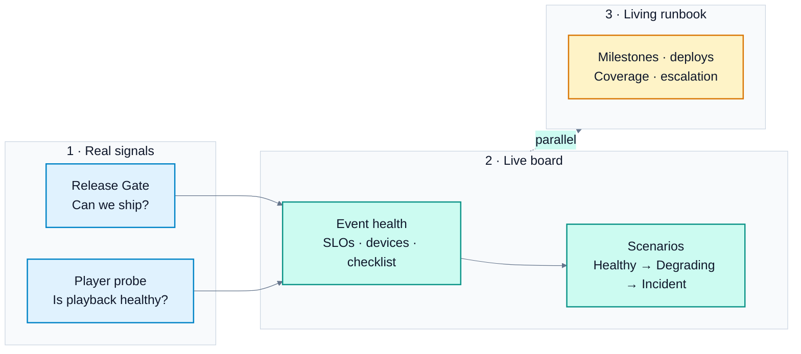

# 👩‍💻 Live Event War Room

A **live-event operations board** plus a **living runbook** for pre-prod and production windows.

This project shows how I think about release and playback readiness in media and streaming. The Live board mixes **real monitoring signals** with **scenario data** so you can walk Healthy → Degrading → Incident without touching a production CDN. The Runbook covers milestones, deploys, coverage, and escalation from weeks out through launch and wrap.

## How the flow works



**In plain English**

1. **Real signals** — release gate + player probe  
2. **Live board** — health view + scenario walkthrough  
3. **Living runbook** — plan, coverage, and escalation running in parallel for pre-prod and production

## What problem this solves

Shipping code is only half the job on a live window. You also need a shared view of:

- Can we ship? (release gate)
- Is playback healthy right now? (probe + SLO view)
- What is the plan, who is on coverage, and how do we escalate? (runbook)

This lab puts those pieces on one surface.

## What’s on the Live board

**Real signals**
- **Release Gate** — pulls latest status from [Release Gate Lab](https://release-gate-lab.vercel.app/) (Azure Pipelines when configured)
- **Player probe** — plays a public sample HLS stream in the browser and measures startup, rebuffers, and errors (`hls.js`)

**Scenario view**
- Event hero, playback SLOs, device breakdown, ops checklist, and signal feed
- Switch scenarios: Healthy → Degrading → Incident
- Clearly labeled so it is not confused with live telemetry

## What’s in the Runbook

Four tabs, same shape as a real launch spreadsheet:

| Tab | Contents |
|-----|----------|
| **Run Book** | Important tasks and milestones (Pre-Launch through Wrap), scheduled production deploys, escalation |
| **Coverage Plan** | Shift grid and coverage groups by role |
| **Important Links** | Tool placeholders (shown as text, not live links) |
| **Contact Info** | Role-based contacts with example channels only |

Dates use placeholders like `Month Day` and `Date Frame`. Owners are **roles**, not personal names, so the template stays safe to share publicly.

## Quick start

**Prerequisites:** Node.js 18+

```bash
git clone https://github.com/ramonacraft/live-event-war-room.git
cd live-event-war-room
npm install
npm run dev
```

Open the URL Vite prints (usually `http://localhost:5173`).

You should see **Live board** and **Runbook** in the top nav. On the board, check Release Gate, click **Start probe**, then try the scenario switcher. Open **Runbook** for the living plan.

## How to walk the product

1. **Release Gate** — latest gate outcome from Release Gate Lab
2. **Start probe** — real startup and rebuffer metrics from a public HLS sample
3. **Scenario switcher** — Healthy → Degrading → Incident for multi-device ops judgment
4. **Runbook** — milestones, deploy slots, coverage, and escalation beside the board

## Stack

- Vite + React 19 + TypeScript + `hls.js`
- Scenario data in `src/data/scenarios.ts`
- Runbook template in `src/data/runbook.ts`
- Local Release Gate proxy: `/release-gate-api` → Release Gate Lab `/api/runs`

## Project layout

```text
src/
  components/     Board panels, player probe, release gate strip, runbook
  data/           Scenarios, runbook template, gate fallback
  types/          Shared types
  utils/          SLO helpers, Release Gate fetch and mapping
```

## Related work

- [Release Gate Lab](https://github.com/ramonacraft/release-gate-lab) — lean Playwright quality gate and go/no-go dashboard
- This war room — playback and ops view for the live window, with a runbook alongside

## Status

| Area | Status |
|------|--------|
| Live board + scenarios + runbook | Ready |
| Player probe (public HLS) | Ready |
| Release Gate → Azure (via Release Gate Lab) | Ready when Lab env vars are set |
| Public deploy of this app (Vercel) | Optional next step |

## Notes

- Player probe uses a **public** Mux test stream, not a production catalog or CDN.
- Runbook contacts and links are placeholders on purpose.
- See [AGENTS.md](./AGENTS.md) for contributor conventions in Cursor.
